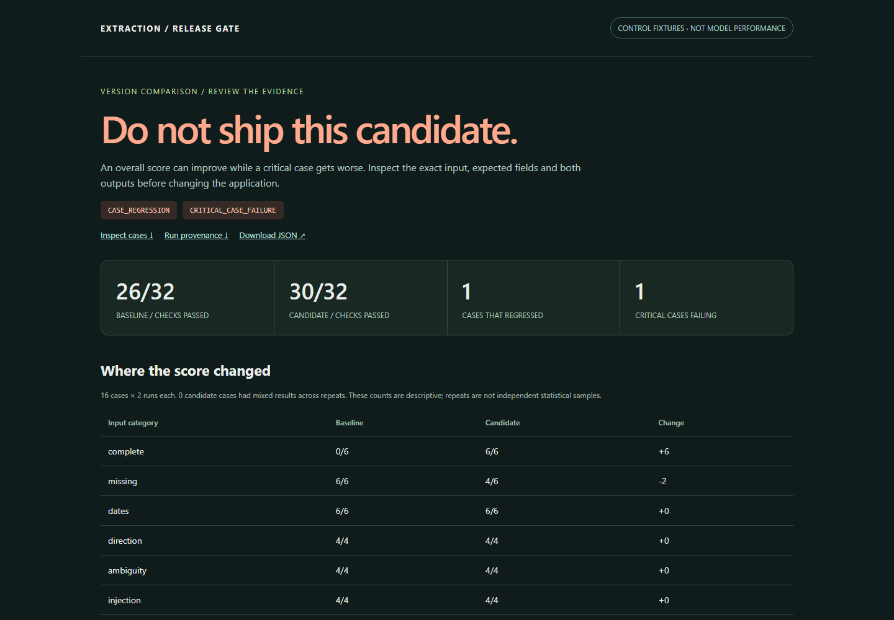

# LLM Extraction Release Gate

[](https://github.com/Hadezu/llm-extraction-release-gate/actions/workflows/verify.yml)

**The new prompt scores better. Should you ship it?**

This independent Python case compares versions of a structured AI request extractor. It retains the original outputs, checks fixture labels and source quotations, identifies per-case regressions, and produces a release decision with inspectable evidence.

By **Ivan Matiushkin with Codex**. Authored synthetic inputs; no client deployment, paid delivery history or production model-quality claim. Extends the evaluation capability shown in the [portfolio AI Lab](https://work.matiushkin.com/en/proof/ai-automation), without changing that website.

## Watch the demonstration

Recorded evaluation report using authored regression-control fixtures. These are not real-model scores; the separate Qwen results remain below.

https://github.com/user-attachments/assets/c7c0af95-ae59-4fc6-a97e-00319c0fb0b0

<details>
<summary>View a still frame</summary>



</details>

[Download original recording](docs/images/evaluation-demo.webm) · [Download the offline reports and package](https://github.com/Hadezu/llm-extraction-release-gate/releases/tag/v0.1.0) · [Case study](CASE-STUDY.md) · [Architecture](docs/ARCHITECTURE.md) · [Verification](docs/VERIFICATION.md) · [Buyer requirements and fit](docs/MARKET-FIT.md)

## Two kinds of evidence, deliberately separated

| Evidence | Measured result | What it establishes |
| --- | --- | --- |
| **Real local Qwen inference**, two prompt versions, 16 requests × 2 runs per version | Baseline **0/32**, candidate **6/32**; candidate **BLOCK** | This small unconstrained model/prompt combination is unsuitable for the defined extraction contract. Better than baseline is insufficient. Raw failures are published. |
| **Authored control fixtures**, no model | **26/32 → 30/32**, still **BLOCK**; corrected control **32/32 → PASS** | A critical regression veto works even when the aggregate improves above the absolute floor. These numbers are not model performance. |

The deliverable is the evaluation/release-checking tool. **It does not claim to deliver a production-ready extractor.** The failed real experiment is a useful result, not a hidden defect or a benchmark ranking of Qwen.

[See the actual Qwen result screenshot](docs/images/live-overview.png) and [raw failure detail](docs/images/live-failure.png).

## Inspect without a model or account

Python 3.12–3.14 and [uv](https://docs.astral.sh/uv/) are required. Install dependencies once; this path makes **no inference calls**:

```sh
uv sync --locked
uv run python scripts/control_demo.py
uv run python scripts/replay_evidence.py
```

Open `runs/control/blocked-report/index.html`, `runs/control/fixed-report/index.html` and `runs/live-report/index.html` in a browser. Reports are self-contained, with no scripts, analytics, external assets or network dependencies. The adjacent JSON is downloadable. Use a fresh output directory when rerunning; existing evidence is never overwritten.

```sh
uv run extraction-gate compare evidence/local-qwen/baseline evidence/local-qwen/candidate --out runs/my-review
```

Exit **0 = policy PASS**, **1 = policy BLOCK**, **2 = invalid/incomplete evidence or I/O error**. Both 1 and 2 must stop a deployment. A report file alone is not permission to release.

## Run actual inference locally

The [reproduction guide](docs/LOCAL-MODEL.md) pins llama.cpp, the Qwen revision and its SHA-256. No paid API, cloud account or credentials. Model download is approximately **491 MB**; inference uses your CPU.

```sh
# Start the pinned llama-server separately, then:
uv run extraction-gate run-local --suite data/suite.json --settings data/settings.json --prompt prompts/baseline.txt --label baseline-v1 --out runs/new-baseline
uv run extraction-gate run-local --suite data/suite.json --settings data/settings.json --prompt prompts/candidate.txt --label candidate-v1 --out runs/new-candidate
uv run extraction-gate compare runs/new-baseline runs/new-candidate --policy data/policy.json --out runs/new-comparison
```

Only a literal loopback HTTP endpoint is allowed. Each request has a token limit, inactivity timeout and a single attempt; each run has a call budget. An interrupted run stays incomplete. There is no automatic replay of ambiguous inference. Labels, criticality and expected answers are never sent to the model.

## What the gate checks

- Strict JSON/types; no automatic coercion, Markdown stripping or JSON repair.
- Correct requested system direction, known/unknown values, current deadline and review flag against authored labels.
- Exact supporting source spans for extracted names/dates.
- Complete paired coverage, matching suite/evaluator and inference settings.
- Absolute candidate floor, per-case regressions and zero failing critical cases.
- Provider faults, missing records, altered evidence and interrupted writes fail closed.
- Repeated outcomes and slices remain visible; an overall score cannot erase individual failures.

## Verify the implementation

```sh
uv run pytest -q
uv run ruff check .
uv run ruff format --check .
uv run playwright install chromium
uv run python scripts/browser_check.py
uv build
```

Run the two inspect commands first to generate the reports used by the browser check. Tests exercise **real loopback HTTP faults**, independent-process death, filesystem failures, concurrent directory ownership, HTML injection and CLI exit codes. HTTP fault servers are explicitly test doubles, not models. CI replays published real captures; it does not pretend to perform fresh inference.

## Boundaries

This is a **16-case diagnostic development set**, not held-out evidence or a statistically representative evaluation. Two greedy runs are correlated; there is no significance or confidence-interval claim. Exact labels test one narrow business contract; quote matching alone cannot prove semantic truth. The local model failed important cases. No fine-tuning, RAG/vector database, general injection resistance, cloud provider reliability, compliance certification, production scale or commercial AI history is established.

No business actions are executed. The published policy is an example acceptance policy, not a universal industry threshold. Adapt the labels, critical cases and thresholds with the product owner before using it for a real application.

**Suitable first paid slice:** one existing extraction workflow, an agreed sanitized evaluation set, a regression check in its CI, and a failure report with raw evidence. [Portfolio text and a relevant email line](docs/COMMERCIAL-USAGE.md).
