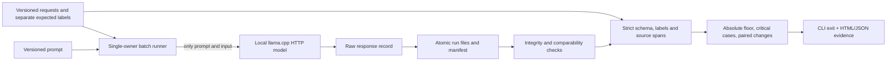

# Architecture and guarantees

## Contract and scoring

Output has action, source, target, deadline, review_required and evidence quotations. `data/suite.json` contains separately authored labels and rationales. A response passes only when all expected fields and source-span checks pass. No JSON repair, coercion, hidden retries or model judge. The input set is small and synthetic; labels require review before adapting this to another product.

Source-span matching verifies textual presence and that the extracted value occurs in the quote. It does not establish semantic entailment. The withdrawn-date test illustrates this: a real quotation can still support the wrong deadline under the task's semantics. The expected label catches that one known case, not every semantic error.

The gate defaults to 90% passing candidate outputs, zero case pass-count decreases, and all critical outputs passing. Thresholds are explicit example policy, recorded with a hash. Critical labels are agreed per case, not inferred by the model. A candidate with the same failures as its baseline can still be blocked by the absolute floor or critical rule. Repeated outputs are counted but not treated as independent samples.

## HTTP boundary

The adapter supports the llama.cpp chat envelope at an explicit numeric loopback address. No credentials, environment proxies, redirects or remote hostnames. Only system prompt and input go into messages; labels and metadata remain local. A model alias mismatch, malformed envelope or bad usage values becomes a provider-evidence error. The model file hash/revision and runtime are operator-supplied provenance; the HTTP protocol itself does not attest the loaded weights.

Each planned request is attempted once, with a generation token limit. HTTPX timeouts are **per I/O inactivity**, not a hard whole-request wall-clock deadline. The batch call limit is not a monetary budget or a bound on prompt tokens. A response body larger than 128 KiB is rejected; non-200 error bodies are not retained. Full decodable HTTP 200 envelopes are retained, including malformed JSON. A timeout is ambiguous and never automatically repeated. Requests use `cache_prompt=false`; hardware/kernel differences can still change outputs at temperature zero.

There is no downstream tool execution. The only writes are local evidence and reports. Adding a remote provider, secrets, customer datasets or executing extracted work would require a separate integration and review.

## File ownership and crash behavior

A new run directory is created exclusively; competing creators cannot both own it. Each JSON snapshot is written to a same-directory temporary file, flushed/fsynced, then atomically renamed. The manifest lists canonical SHA-256 hashes. A brief Windows sharing violation gets a bounded retry; permanent failures propagate, with the old snapshot preserved. This is **not** an ACL bypass.

A record is saved before its manifest reference. Process death between steps leaves incomplete/extra files and cannot produce a valid release comparison. A manifest becomes complete only when all planned case/repeat keys are present. Budget-skipped cases are explicit records; completed bookkeeping does not make them successful evidence. Interrupted runs are not resumed: review what happened and create a distinctly named new run if another inference attempt is appropriate.

Readback rejects missing/extra files, unsealed manifests, content mismatches, duplicate JSON keys, invalid identities and symlinked evidence files. It verifies the full planned key set. Suite and evaluator must match; temperature, seeds, repeats, token/call limits and timeouts must match. Model/runtime and prompt may differ intentionally and are reported as changed variables, not proof of causation.

**Limits:** no filesystem directory fsync/power-loss durability claim, no shared-network-filesystem guarantee, no multi-user service. Hashes detect changes relative to a manifest, not malicious rewriting of both data and manifest. Files remain editable by their owner. No authenticated timestamps or digital signatures. CI should consume trusted artifacts under its own access policy.

## Report and CI boundary

Jinja autoescapes untrusted text. The report is static HTML with restrictive CSP, no JavaScript, no external fonts/images or tracking. Native details sections allow inspection; the adjacent JSON contains the decision and per-case findings. Output directories are exclusive so an older review is not overwritten.

CLI exit 0 means this policy passes; 1 blocks; 2 means no valid comparison could be made. Both nonzero outcomes stop release. The repository CI verifies the **tool**, deliberate negative controls and replay of the published local inference. Its green badge does not approve the demonstrated Qwen configuration and does not claim fresh hosted inference.

Dependencies are locked in uv.lock. No database, worker queue, deployment platform or agent framework is needed for this bounded local batch. Original focused code plus the existing llama.cpp runtime gives a smaller review surface than modifying an unrelated CRM.

## Primary implementation references

- [llama.cpp pinned server documentation](https://github.com/ggml-org/llama.cpp/blob/b11430/tools/server/README.md)
- [Pydantic strict validation](https://docs.pydantic.dev/latest/concepts/strict_mode/)
- [HTTPX timeout semantics](https://www.python-httpx.org/advanced/timeouts/)
- [Jinja autoescaping](https://jinja.palletsprojects.com/en/stable/api/#autoescaping)
